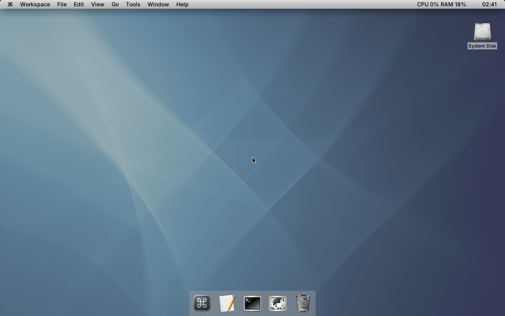

# gershwin-on-nextbsd

Builds a [Gershwin](https://github.com/gershwin-desktop) desktop live ISO on top
of [NextBSD](https://github.com/nextbsd-redux/nextbsd).

CI assembles the NextBSD base+kernel+userland from packages — one
`pkg install NextBSD-everything` out of the [nextbsd-pkg](https://github.com/nextbsd-redux/nextbsd-pkg)
flat repo, seeded with the admin-owned `/etc` from
[nextbsd-overlays](https://github.com/nextbsd-redux/nextbsd-overlays) (the same
package-driven model NextBSD's own build now uses) — chroot-builds Gershwin into
that rootfs (from a FreeBSD VM), adds Gershwin's `loginwindow` alongside the base
getty, and repackages the result into a live ISO that boots exactly like
NextBSD's own — a tiny mfsroot assembles an on-demand uzip-compressed root plus a
tmpfs/unionfs writable overlay, then `sysctl vfs.pivot` adopts the union as `/`
and execs launchd.

A fresh ISO is published to the rolling [`continuous`](../../releases/tag/continuous)
release on every push to `main`.

*(Screenshot auto-captured by CI after booting the live ISO and logging in.)*

## Layout

| Path | Purpose |
|---|---|
| `build.sh` | `pkg install` NextBSD base → chroot-build Gershwin → repackage live ISO. Runs inside a FreeBSD VM. |
| `.github/workflows/build.yml` | build → boot-test → publish continuous release. |
| `tests/boot-test.sh` | Boots the ISO under qemu/OVMF and asserts the `vfs.pivot` live-root pipeline. |
| `overlays/System/Library/LaunchDaemons/` | Gershwin launchd jobs added to the image (`loginwindow`, `dshelper`, `gdomap`, D-Bus system bus). |
